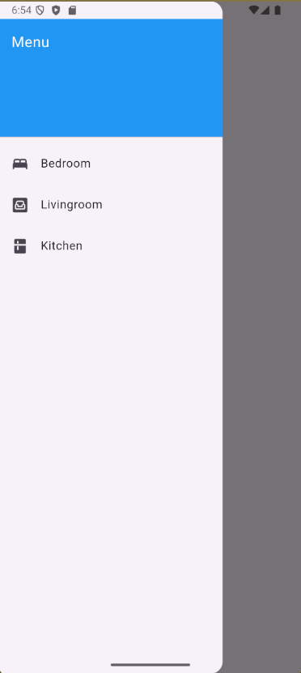
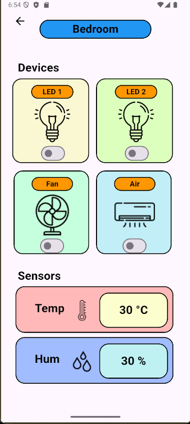
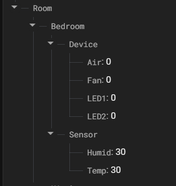
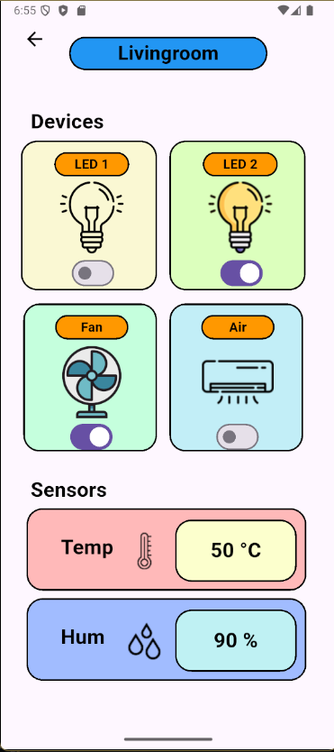
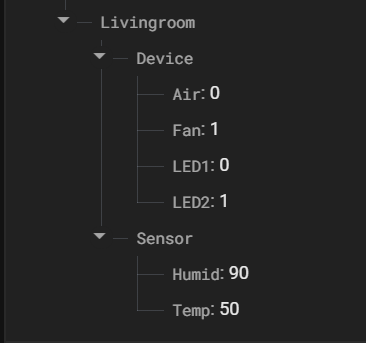
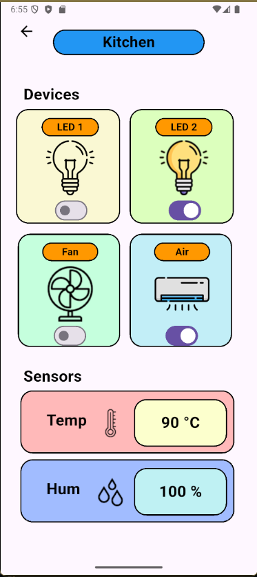
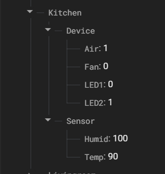

# Xây Dựng App Điều Khiển Nhiều Thiết Bị Trong Nhiều Phòng Có Liên Kết Với DB

A new Flutter project.

## Getting Started

This project is a starting point for a Flutter application.

A few resources to get you started if this is your first Flutter project:

- [Lab: Write your first Flutter app](https://docs.flutter.dev/get-started/codelab)
- [Cookbook: Useful Flutter samples](https://docs.flutter.dev/cookbook)

For help getting started with Flutter development, view the
[online documentation](https://docs.flutter.dev/), which offers tutorials,
samples, guidance on mobile development, and a full API reference.

## Liên Kết Với DataBase

[Xem hướng dẫn liên kết tại đây](https://www.youtube.com/watch?v=dyYiqlKBBKM)

## Liên kết DB với code

Trong main.dart, thực hiện

```dart
import 'package:firebase_core/firebase_core.dart';
```

Trong các file.dart thành phần muốn kết nối với firebase, thực hiện

```dart
import 'package:firebase_database/firebase_database.dart';
```

## Ẩn file google-services.json để không lộ key secret

Nếu chưa từng `git add` vào repo, chỉ cần thêm lệnh

```dart
/android/app/google-services.json
```

vào file `.gitignore`, sau đó thực hiện các lệnh

```bash
git add .
git commit -m 'note message'
git push origin <branch name>
```

file `google-services.json` sẽ bị ẩn hoàn toàn khỏi repo kể cả trên máy local và trên Github

### Dùng cách như trên, nó sẽ hide cả file trên cả repo local, tốt nhất là tạo 1 file mẫu để khi ai clone về thì tự set file `google-services.json` của mình vào `android/app/`

## Set/Get data Firebase

Ở đầu class của file.dart thành phần, dùng lệnh để chỉ rõ đường dẫn trên firebase để truy cập vào nơi lưu datadata:

```dart
final DatabaseReference _variablePath = FirebaseDatabase.instance.ref('Đường dẫn đến nơi muốn lưu data trên firebase realtime',);
```

Tất cả việc “lấy data từ database về” đều được thực hiện thông qua `StreamBuilder<DatabaseEvent>`. Đây chính là nơi app lắng nghe dữ liệu thay đổi từ Firebase và cập nhật giao diện theo thời gian thực.

### Get data từ firebase về app

Trong `StreamBuilder<DatabaseEvent>` thực hiện đoạn code sau để lấy dữ liệu đúng với kiểu dữ liệu của đối tượng

Tổng quát

```dart
final value = snapshot.data?.snapshot.value;

final int intValue = int.tryParse(value.toString()) ?? 0;
final double doubleValue = double.tryParse(value.toString()) ?? 0.0;
final bool boolValue = value.toString() == "true" || value.toString() == "1";
final String stringValue = value.toString();
```

Áp dụng và tinh chỉnh nhẹ trong code

```dart
// Lấy đữu liệu dạng bool từ firebase
StreamBuilder<DatabaseEvent>(
  stream: _variablePath.child('đối tượng cần lấy data trên Firebase').onValue, // Lấy dữ liệu của đối tượng từ Firebase
  builder: (context, snapshot) {
    final bool variableState = (snapshot.data?.snapshot.value ?? 0) == 1 ; // Dữ liệu nhận về
  },
)

// Lấy dữ liệu có thể thay đổi kiểu từ firebase
StreamBuilder<DatabaseEvent>(
  stream: _variablePath.child('đối tường cần lấy data trên Firebase').onValue, // Lấy dữ liệu
  builder: (context, snapshot) {
    final dynamic value = snapshot.data?.snapshot.value ?? 0;
  },
)
```

Sau khi lấy dữ liệu về và lưu vào các biến tương ứng, có thể dùng các biến này (variableState, value) để thực hiện các chức năng điều khiển trên App.

### Set data từ App lên Firebase

Có nhiều cách để gửi data từ App lên firebase như:

| Mục đích                                 | Lệnh dùng            | Mô tả                                              |
| ---------------------------------------- | -------------------- | -------------------------------------------------- |
| Ghi (thay thế toàn bộ giá trị tại path)  | `.set(value)`        | Ghi dữ liệu mới, xóa dữ liệu cũ tại node đó        |
| Cập nhật một phần (giữ lại dữ liệu khác) | `.update({...})`     | Cập nhật một số trường con mà không ghi đè toàn bộ |
| Thêm phần tử mới (tạo key tự động)       | `.push().set(value)` | Dùng để thêm đối tượng mới vào danh sách           |
| Xóa dữ liệu                              | `.remove()`          | Xóa giá trị tại path đó                            |

Nhưng áp dụng trong code, thực hiện phương thức set để gửi dữ liệu, cập nhật toàn bộ dữ liệu cho đối tượng luôn.

```dart
_variablePath.child('đối tượng cần thay thế data trên Firebase').set(value);
```

## Giao diện từng phòng

### Giao diện Drawer



### Giao diện Bedroom





### Giao diện Livingroom





### Giao diện Kitchen




