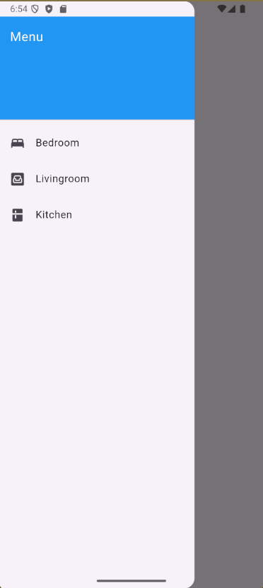
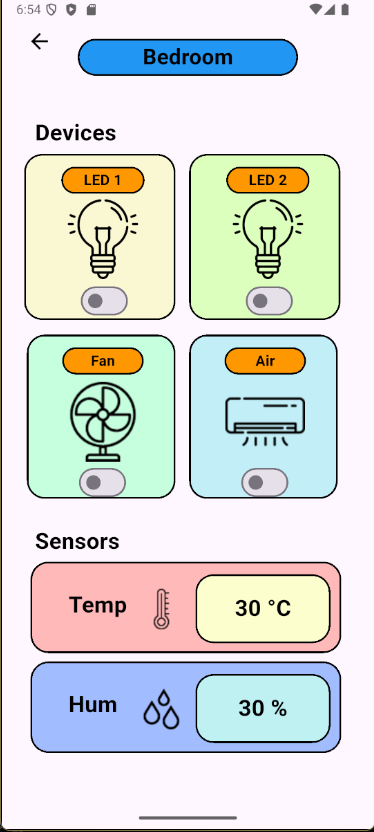
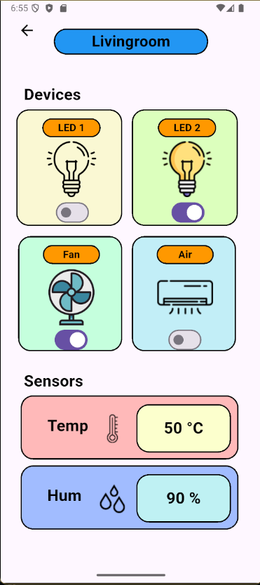
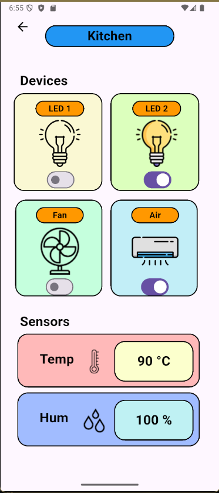

# Xây Dựng App Điều Khiển Nhiều Thiết Bị Trong Nhiều Phòng Có Liên Kết Với DB

A new Flutter project.

## Getting Started

This project is a starting point for a Flutter application.

A few resources to get you started if this is your first Flutter project:

- [Lab: Write your first Flutter app](https://docs.flutter.dev/get-started/codelab)
- [Cookbook: Useful Flutter samples](https://docs.flutter.dev/cookbook)

For help getting started with Flutter development, view the
[online documentation](https://docs.flutter.dev/), which offers tutorials,
samples, guidance on mobile development, and a full API reference.

## Liên Kết Với DataBase

[Xem hướng dẫn liên kết tại đây:](https://www.youtube.com/watch?v=dyYiqlKBBKM)

## Liên kết DB với code

Trong main.dart, thực hiện

```dart
import 'package:firebase_core/firebase_core.dart';
```

Trong các file.dart nhỏ, thực hiện

```dart
import 'package:firebase_database/firebase_database.dart';
```

## Giao diện từng phòng

### Giao diện Drawer



### Giao diện Bedroom



### Giao diện Livingroom



### Giao diện Kitchen


